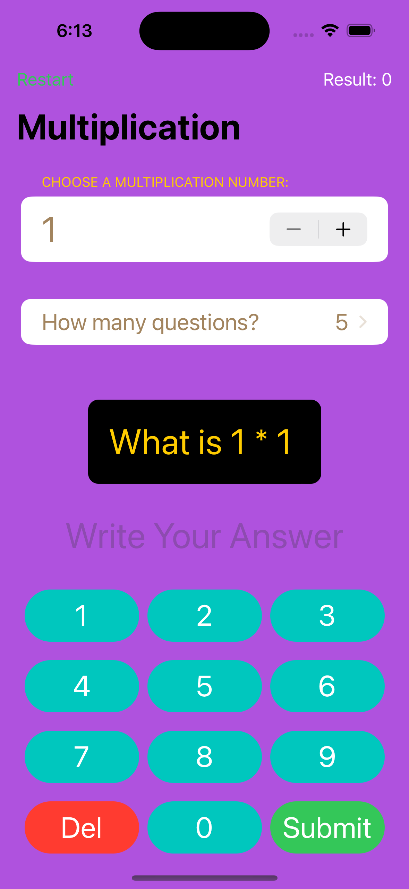
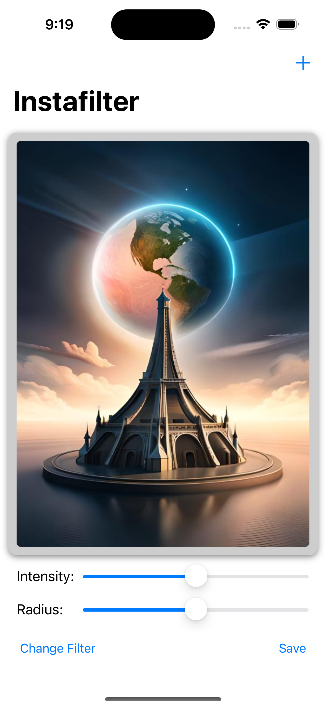
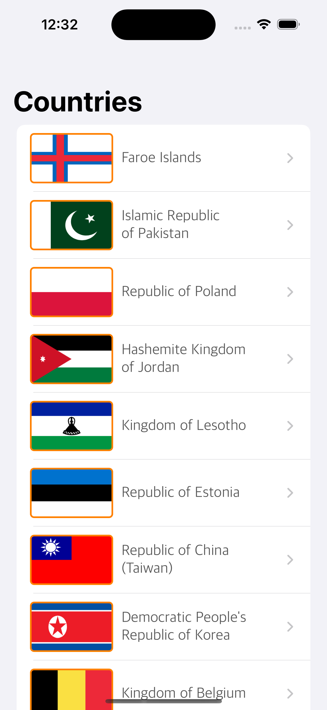

# 100-days-of-swift

Solutions to Paul Hudson's "100 days of Swift and 100 days of SwiftUI" projects and challenges.

https://www.hackingwithswift.com/100

## Notes
- This is 100 days of **Swift**. For 100 days of **UIKit** 
- This is 100 days of **SwiftUI**. For 100 days of **SwiftUI** 

---

---
  ## Projects from course 100 days of SwiftUI
  ##### In this cource I used:
  - VStack, HStack, ZStack, Stepper, DatePicker, DateFormatter etc...
  - Deleing list items with onDelete. 
  - Storing settings with UserDefaults. 
  - Codable / JSONEncoder.
  - NavigationView with NavigationLink. 
  - ScrollView / GeometryReader
  - Animations
  - Codable data with URLSession 
  - Core Data 
  - MapKit
  - Accessibility
  - UIKit programmatically
  - UITableViewController
  - UICollectionView
  - MapKit
  - NotificationCenter
  - And much more... 
  
  
  
  
  
  
  
  
  
  
  
  
  
  
  
  
  
  

